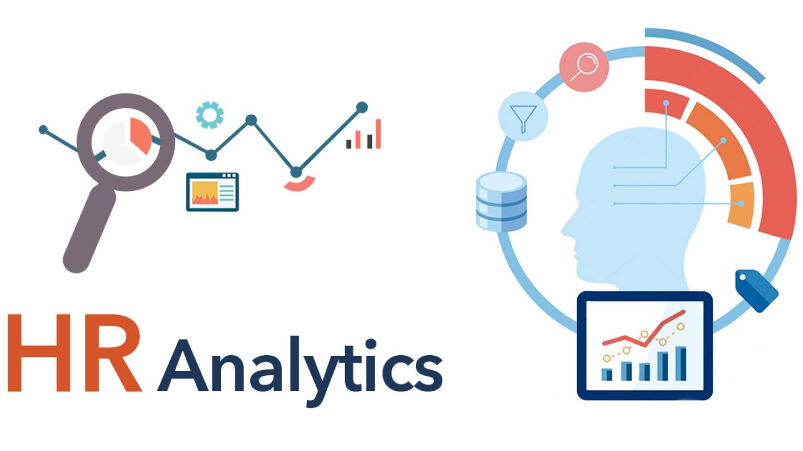
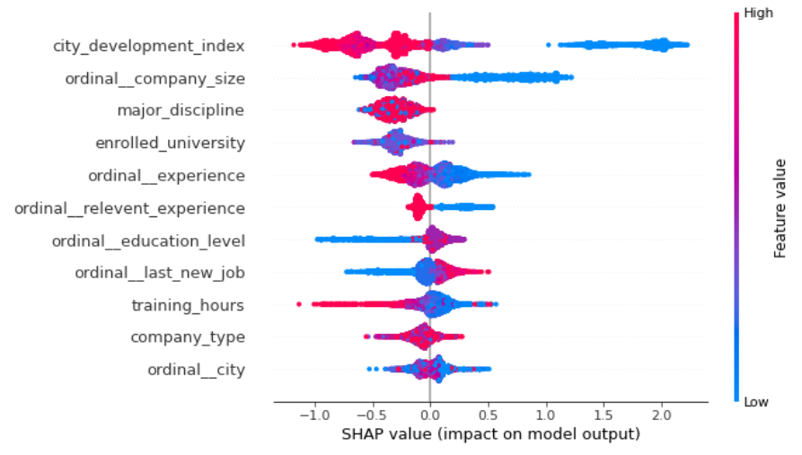

# HR Analytics: Job Change of Data Scientists
This project is a requirement of graduation from PandasGroup_JC_DS_BSD_JKT_13_Final Project

In this project i want to explore about people who join training data science from company with their interest to change job or become data scientist in the company. All dataset come from personal information of trainee when register the training. This project include Data Analysis, Modeling Machine Learning, Visualization using SHAP using 13 features and 19158 data.

<!-- TABLE OF CONTENTS -->

  
Table of Content

  <ol>
    <li>
      <a href="#background">Background</a>
    </li>
    <li>
      <a href="#data-understanding">Data Understanding</a>
    </li>
    <li>
      <a href="#exploratory-data-analysis">Exploratory Data Analysis</a>
    </li>
    <li><a href="#data-analytics">Data Analytics</a></li>
    <li><a href="#data-preprocessing">Data Preprocessing</a></li>
    <li><a href="#model-selection">Model Selection</a></li>
    <li><a href="#explainable-and-interpretable-machine-learning">Explainable and Interpretable Machine Learning</a></li>
    <li><a href="#example-application-in-real-life">Example Application in Real Life</a></li>
    <li><a href="#conclusion-and-recommendation">Conclusion and Recommendation</a></li>
    <li><a href="#contributors">Contributors</a></li>
  </ol>

## Background
**Context :**  

A company which is active in Big Data and Data Science wants to hire data scientists among people who successfully pass some courses which conduct by the company From this dataset, we assume if the course is free video learning. Many people signup for their training. Company wants to know which of these candidates are really wants to work for the company after training or looking for a new employment because it helps to reduce the cost and time as well as the quality of training or planning the courses and categorization of candidates. Information related to demographics, education, experience are in hands from candidates signup and enrollment. The source of this dataset is from <a href="https://www.kaggle.com/adityadesai13/used-car-dataset-ford-and-mercedes?select=audi.csv">Kaggle</a>.  

**Problem Statement :**  
Hiring process could be time and resource consuming if company targets all candidates only based on their training participation. Company wants to increase recruitment efficiency by knowing which candidates are looking for a job change in their career so they can be hired as data scientist. If company use old method, they need to offer all candidates and it will use more money and HR Departments have time limit too, they can't ask all candidates 1 by 1 and usually they will take random candidates. It still not efficient because people want to change job is less than not. So we need new method which can reduce cost (money and time) and make success probability increase to reduce CPH.

**Goals :**  
Reduce cost and increase probability candidate to be hired can make cost per hire decrease and recruitment process more efficient. To predict candidates who will change job or not, we can't use simple statistic and need machine learning so company can categorized candidates who are looking and not looking for a job change. In the end HR Department can have more option to recruit with same budget if compare with old method and also have more time to focus at candidate qualification and get the best candidates to company.

**Metric Evaluation :**    
Determine the suitable metric to rate the performance from the model

## Data Understanding

| Feature      	| Description                                                                                                                                                                                                               	|
|--------------	|---------------------------------------------------------------------------------------------------------------------------------------------------------------------------------------------------------------------------	|
| enrollee_id         	| Unique ID for candidate                                                                                                                                                                                                             	|
| city         	| City code (unknown)                                                                                                                                                                                            	|
| city_ development _index (CDI)        	| Developement index of the city (scaled). Ranks cities according to their Infrastructure, Waste Management, Health, Education, and City Product                                                                                                                                                                                                         	|
| gender 	| Gender of candidate                                                                                                                                                                                                 	|
| relevent_experience      	| Relevant experience of candidate                                                                                                                                                                                 	|
| enrolled_university     	| Type of University course enrolled if any                                                                                                                                                                               	|
| education_level          	| Education level of candidate                                                                                                                                                                                                         	|
| major_discipline          	| Education major discipline of candidate                     	|
| experience   	| Candidate total experience in years 	|
| company_size        	| No of employees in current employer's company                                                                                                                                                                                                               	|
| company_type          	| Type of current employer                                                                                                                                                      	|
| lastnewjob   	| Difference in years between previous job and current job 	|
| training_hours        	| training hours completed                                                                                                                                                                                                               	|
| target         	| Candidates who decide looking for a job change or not                                                                                                                                                      	|

## Exploratory Data Analysis
At this stage, a brief analysis of the data will be carried out, as follows:
* Data distribution
* Data Correlation
* Identify Missing Value
* Identify Duplicate Data
* Identify Data Imbalance

## Data Analytics
At this stage, another information analysis will be carried out, as follows:
* Data Proportion
* Independent Test With Chi Square

## Data Preprocessing
At this stage, data preparation and processing will be carried out before being used as a data model, as follows:
* Fill Missing Value
* Data Inconsistency
* Feature Engineering
* Feature Selection

## Model Selection
At this stage will be done making and optimizing the machine learning model, as follows:
* Model Benchmark
* Imbalance Data Handling
* Hyperparameter Tuning
* Threshold Adjustment

## Explainable and Interpretable Machine Learning
At this stage there will be an explanation in the decision making of the machine learning model, in the following ways:
* SHAP 

## Example Application in Real Life
At this stage we try to aplicate machine learning to solve business problem and get business objective

## Conclusion and Recommendation
We conclude our result and give recommendation based on it

## Contributors:
Abdul Hamid - abdulhamidwinoto@gmail.com  
Juan Antonio Suwardi - antonio.juan.suwardi@gmail.com  
Agatha Putri Algustie - agthaptri@gmail.com
